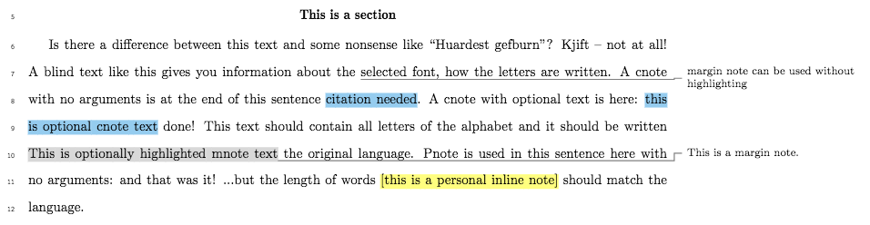

# Compact Proposal

A LaTeX class for producing compact and nicely formatted grant proposal documents.

This is a LaTeX class to make a compact proposal document. It provides easy switches for common formatting needs, including margins, headers, figures, and page numbering. It also allows for compiling draft and submission versions. Note you should compile this document twice in `draft` mode if you want margin notes to work right.

##  Usage

Call this document class with `\documentclass{compact_proposal}`. It takes the following options (currently):
* `draft` - which builds the document with double spacing, an extra margin for notes, and allows three kinds of notes.
* `nonotes` which disables notes, but preserves spacing and geometry choices for draft.
* `final` which single spaces, collapses lists, and makes standard 1 inch margins.

Allowed notes in `draft` mode are:
* `\cnote` which inputs a grey highlighted text reading 'citation needed' if no arguments are supplied, or optional text if supplied.
* `\pnote` which inputs a yellow highlighted text with a note for yourself in it.
* `\mnote` which highlights text grey, then puts in a margin note and connects the two with a grey line.

```latex
Integer tempus, risus sed mattis scelerisque, \cnote purus neque luctus ex, vel fringilla risus risus nec elit.
Suspendisse non magna ac augue aliquet maximus.
Sed id magna dolor.
Nullam at massa at ante commodo rhoncus.
Praesent non eleifend eros \cnote[isn't this your advisor's paper?].
Curabitur lorem mauris, posuere at nisi eget, malesuada finibus ex.
Class aptent taciti sociosqu ad litora torquent per conubia nostra, per inceptos himenaeos.
Suspendisse consequat mauris id lectus pharetra laoreet.
Pellentesque eget nibh eget sem porttitor sollicitudin ac ut velit.
\pnote[rewrite this section] Curabitur varius cursus ipsum ac auctor.
Fusce ut porttitor augue, \mnote[highlight this text]{and make this margin note} a mattis dolor.
Duis nec ultricies nunc.
Sed sed auctor leo. Sed interdum semper lectus id vestibulum.
Nam non erat ultrices, aliquam diam eu,\mnote{or just make a margin note.} mattis libero.
```
provides the following:


## Setting up with symbolic links

This class, or really any github-based class, can be called by a symbolic link in your `tex`-tree. This has the benefit of allowing changes from the repository during development to be pulled directly down to the repository, and your use of the class, wherever on your system, will automatically call this version of the class file. This allows you to keep only one version of the file, and not be forced to place it in every folder you want to use the class with.

A proper symbolic link resides in your `tex`-tree and points to the github repository. One example, with pseudocode is below.

For a linux user with the default location of the `texlive` install, the following yields a proper symbolic link:

    sudo mkdir <local_path_to_textree>/tex/latex/compact_proposal
    sudo ln -s <local_path_above_this_repo>/compact_proposal/compact_proposal/compact_proposal.cls <local_path_to_textree>/tex/latex/compact_proposal/compact_proposal.cls

Note that the `tex`-tree is everything below `/usr/share/texlive/texmf-dist/`.

After the above command, a call to hash the `tex`-tree is necessary.

    sudo texhash
